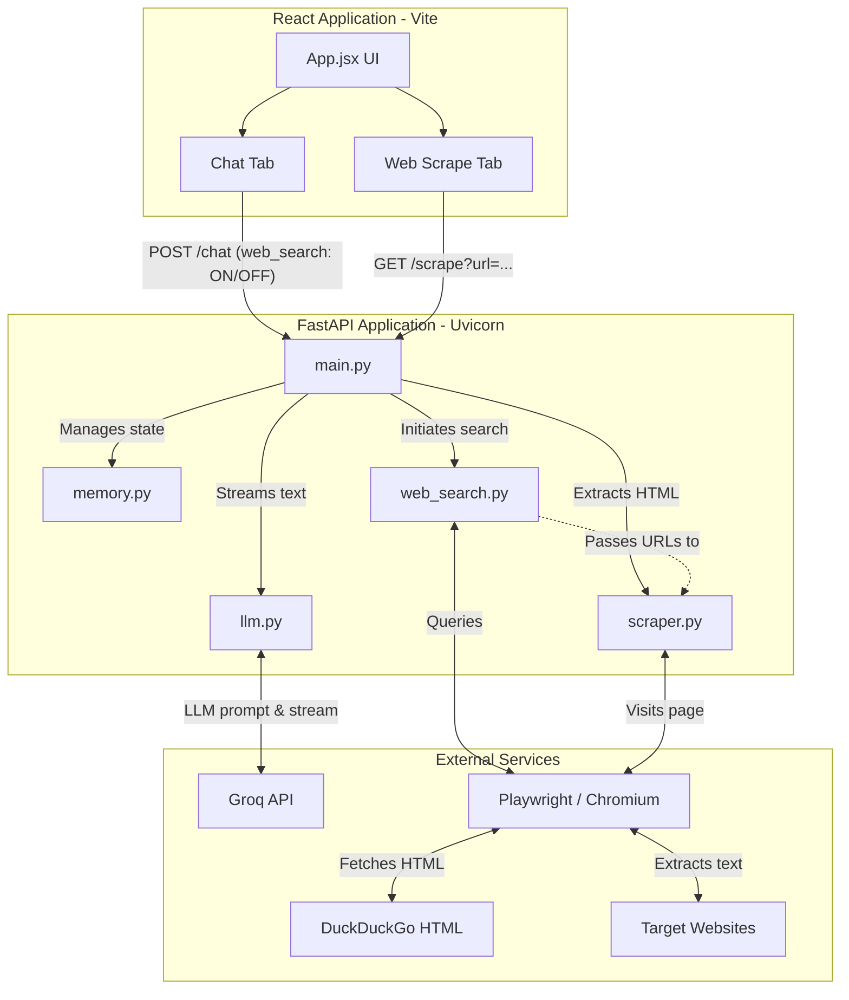

# AI Chatbot Architecture

Here is a high-level overview of the project's architecture, demonstrating how the React frontend interacts with the FastAPI backend, Groq LLM, and Playwright web search/scraper tools.

## System Diagram



## Component Breakdown

### 1. Frontend (`frontend/src/App.jsx`)
- **Chat Interface**: Connects to `POST /chat` and displays Server-Sent Events (SSE) token by token. It has a toggle for `web_search: true | false`. It also parses `type: 'sources'` events to render clickable citation links.
- **Web Scrape Testing Interface**: Connects directly to `GET /scrape?url=...` for testing text extraction from a single URL.

### 2. Backend API (`backend/main.py`)
- **`/chat` Endpoint**: 
  - Records user messages in memory.
  - Checks if `web_search` is enabled. If true, it coordinates between `web_search.py` and `scraper.py` to build an augmented context block.
  - Opens an asynchronous SSE generator stream back to the React client using `stream_groq_response()`.
- **`/scrape` Endpoint**: Isolated helper endpoint to directly call the web scraper.

### 3. Core Backend Modules
- **`llm.py`**: Handles integration with the `AsyncGroq` SDK. Accepts the user conversation history and an optional `search_context`. When a `search_context` is provided, it prepends a strict system prompt instructing Groq to use the sources to formulate the answer.
- **`memory.py`**: An in-memory store that tracks the full conversation history of a user across a session ID, ensuring multi-turn chat capability.
- **`web_search.py`**: A specialized Playwright module that launches headless Chromium, queries `html.duckduckgo.com`, and cleanly extracts the top 5 organic search result titles and URLs.
- **`scraper.py`**: A dedicated webpage scraping module. It validates URLs (preventing internal/local network probing) and uses Playwright to navigate to a page, extract its visible `<body>` text, strip excessive whitespace, and aggressively truncate it to fit within standard LLM context windows (50,000 characters).

## Tech Stack

### Frontend
- **Framework**: React 18
- **Build Tool**: Vite
- **Styling**: Vanilla CSS (`App.css`, `index.css`)
- **Key Features**: Server-Sent Events (SSE) parsing for streaming AI responses.

### Backend
- **Framework**: FastAPI
- **Server**: Uvicorn
- **Language**: Python 3.12+
- **LLM Integration**: Groq SDK (`AsyncGroq`) using the `groq/compound-mini` model.
- **Web Automation**: Playwright (Async API) driving headless Chromium.
- **Search Engine**: DuckDuckGo HTML (`html.duckduckgo.com`).

## File Structure

```text
c:\ai-chatbot\
├── backend/
│   ├── venv/                 # Python virtual environment
│   ├── .env                  # Secrets (Groq API Key)
│   ├── .gitignore            # Git exclusions
│   ├── requirements.txt      # Python dependencies (fastapi, groq, playwright, etc.)
│   ├── main.py               # FastAPI app, endpoints (/chat, /scrape), and SSE generator
│   ├── llm.py                # Groq client integration and system prompting logic
│   ├── memory.py             # In-memory conversation history management
│   ├── scraper.py            # Playwright webpage text extraction and URL validation
│   └── web_search.py         # DuckDuckGo HTML search and URL extraction
└── frontend/
    ├── node_modules/         # JavaScript dependencies
    ├── public/               # Static assets
    ├── src/                  # React source code
    │   ├── App.jsx           # Main UI logic (Chat + Web Scrape tabs)
    │   ├── App.css           # Component styles
    │   ├── index.css         # Global styles and layout overrides
    │   └── main.jsx          # React entry point
    ├── package.json          # NPM dependencies and scripts
    ├── vite.config.js        # Vite configuration
    ├── eslint.config.js      # Linter configuration
    └── .gitignore             # Git exclusions
```
